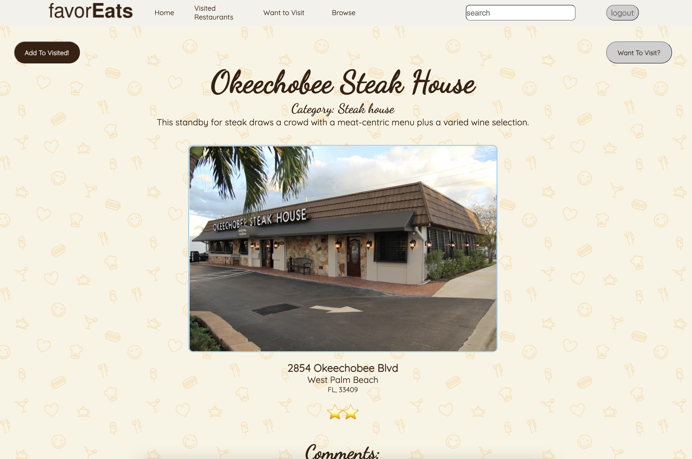

<br />
<p align="center">
  <a href="https://github.com/gch910/favorEats">
    
  </a>

  <h3 align="center">favorEats</h3>

  <p align="center">
    favorEats is a goodreads.com clone that allows for the tracking of restaurants. A user can browse restaurants and add a restaurant to their "Want to Visit" or "Visited" lists. A user can also rate and review restaurants, as well as read the reviews of other users!
    <br />
  <br />
    <a href="https://github.com/gch910/favorEats/wiki"><strong>Explore the docs »</strong></a>
    <br />
    <br />
    <a href="https://favor-eats.herokuapp.com/">View Site</a>
  </p>
</p>

<!-- TABLE OF CONTENTS -->
<details open="open">
  <summary><h2 style="display: inline-block">Table of Contents</h2></summary>
  <ol>
    <li>
      <a href="#about-the-project">About The Project</a>
      <ul>
        <li><a href="#built-with">Built With</a></li>
      </ul>
    </li>
    <li><a href="#notable">Notable Features</a></li>
    <li><a href="#contributing">Contributing</a></li>
    <li><a href="#contact">Contact</a></li>
  </ol>
</details>

<!-- ABOUT THE PROJECT -->
## About The Project
[Click here to view favorEats live on the web!](https://favor-eats.herokuapp.com/)
<br>
 
   
  
</br>


### Built With

* [JavaScript]()
* [HTML]()
* [CSS]()
* [Pug]()
* [Express]()
* [Sequelize]()


### Notable
1. User authorization implemented for all routes with session auth. If a user is not logged in, they are unable to access any of the /restaurants routes and they will not be able to reach the home page. 
2. Comments and Ratings: a logged-in user can navigate to a specific restaurant page by clicking on the link or image, which takes them to the /restaurants/:id route. Here the restaurant info is displayed, including an average rating displayed in stars. The user can comment and rate the restaurant, which all gets stored in the database while also updating to the page immediately. 

*  Challenges Faced: 
1. Incorporating the fetch API presented us with some initial challenges; we struggled in the beginning to connect the front-end request with our back-end routes. After a lot of research and debugging, however, we were able to get the request fully functional, which was very rewarding. 
2. Querying the database correctly was a challenge at first due to dealing with multiple joins tables in our database. We figured out a way to alias one of the joins tables, which allowed us to query for both 'visited restaurants' and 'want to visit restaurants' at the same time. We ended up utilizing this strategy for many other queries, including the individual pages for the restaurants. 

Notable Code: 
Fetch request for removing a visited restaurant from a user's page. 

```
const removeVisitedButton = document.querySelectorAll(".remove-visited-button");
const visitedRestaurantInfo = document.querySelectorAll(".visited-restaurant");
document.addEventListener("DOMContentLoaded", async (event) => {
  removeVisitedButton.forEach((button) => {
    button.addEventListener("click", async (e) => {
      // e.preventDefault();
      const body = { restaurantId: e.target.id };
      console.log("target", e.target.id);
      // addVisitedButton.classList.add("hidden");
      button.classList.add("hidden");
      console.log("hello");
      visitedRestaurantInfo.forEach((info) => {
        // if(info.id === e.target.id)
        //  info.classList.add("hidden")
        if (e.target.id == info.id) info.innerHTML = "";
      });
      try {
        const res = await fetch("/restaurants/visited/delete", {
          method: "DELETE",
          body: JSON.stringify(body),
          headers: {
            "Content-type": "application/json",
          },
        });
        console.log("-------");
        if (!res.ok) {
          throw res;
        }
        // window.location.href = '/'
        const json = await res.json();
        console.log(json);
      } catch (err) {
        console.log(err);
      }
    });
  });
});
```

<!-- CONTRIBUTING -->
## Contributing

Contributions are what make the open source community such an amazing place to be learn, inspire, and create. Any contributions you make are **greatly appreciated**.

1. Fork the Project
2. Create your Feature Branch (`git checkout -b feature/AmazingFeature`)
3. Commit your Changes (`git commit -m 'Add some AmazingFeature'`)
4. Push to the Branch (`git push origin feature/AmazingFeature`)
5. Open a Pull Request

<!-- CONTACT -->
## Contact

* Gabriel Harris - [LinkedIn](https://www.linkedin.com/in/gabriel-harris-249231208/) - [GitHub](https://github.com/gch910)
* Lauren Chambers - [LinkedIn](https://www.linkedin.com/in/lauren-chambers94/) - [Github](https://github.com/laurenchambers)
* Dave Ziegler - [LinkedIn](https://www.linkedin.com/in/dave-ziegler-8830ab94/) - [Github](https://github.com/davezig)
